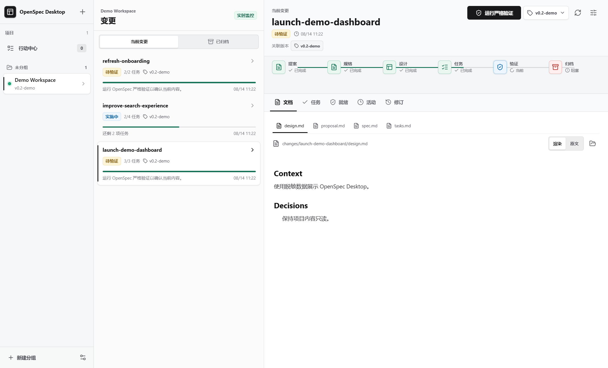
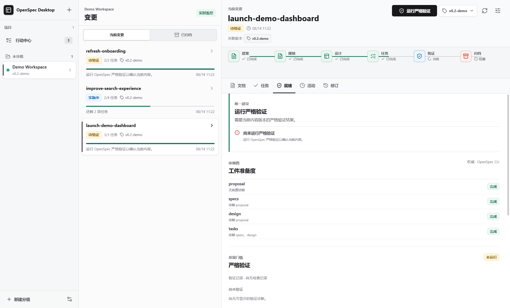
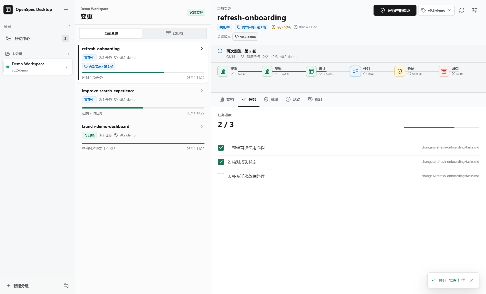
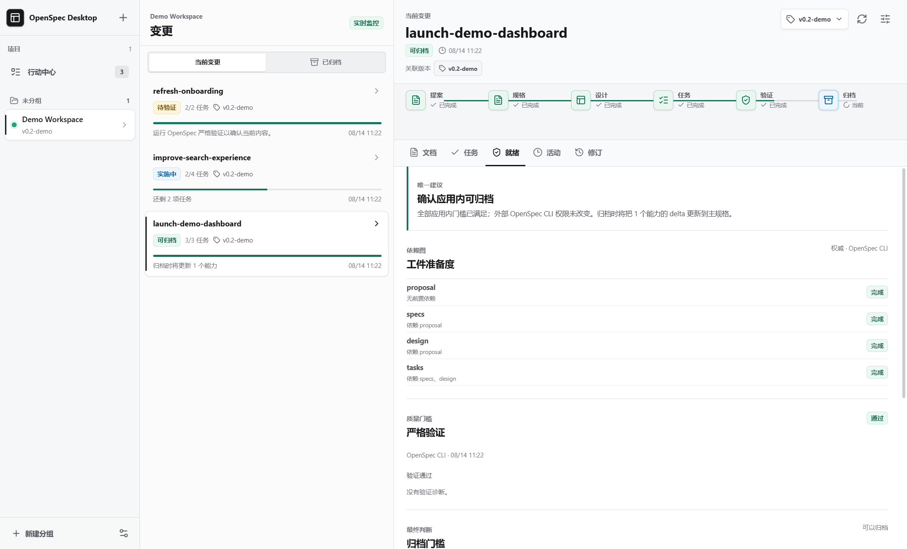

# OpenSpec Desktop 中文操作手册

> 适用版本：OpenSpec Desktop `0.2.0` 源码版（本仓库 `main` 分支，2026-08-14 发布整理）。

OpenSpec Desktop 是一个 Windows 优先的本地 Electron 应用，用于只读查看和监控本机 OpenSpec 项目。应用把项目、Change、任务、生命周期、严格验证结果和本地历史集中到桌面工作区；项目内的 OpenSpec 文件始终是事实来源。

## 1. 适用范围与启动

### 1.1 当前交付范围

本版本通过公开仓库提供源码，不提供 GitHub Release、版本标签、安装程序、Portable 包或应用内帮助页。请按本章从源码安装依赖并启动。

应用对已接入项目保持只读：不会创建或修改 `openspec/` 文件，不会勾选任务、同步主规格、归档 Change，也不会执行 Git 提交或推送。应用自身只在 Electron 的 user-data 目录保存项目登记、界面偏好、历史快照、验证缓存和实施轮次记录。

### 1.2 前置条件

| 项目         | 要求与用途                                                                                         |
| ------------ | -------------------------------------------------------------------------------------------------- |
| 操作系统     | Windows 10/11 x64。项目以 Windows 桌面环境为主要验证目标。                                         |
| Node.js      | 使用 Node.js 24；仓库 CI 当前以 Node.js 24 验证。                                                  |
| pnpm         | 使用 pnpm 11，锁定版本为 `11.16.0`。                                                               |
| Git          | 用于获取源码；应用也会只读使用精确 Git 标签判断项目版本。没有标签或 Git 不可用时仍可使用应用。     |
| OpenSpec CLI | 浏览本地结构时可选；运行严格验证及获取权威工件状态时必需。当前版本已按 OpenSpec CLI `1.8.0` 核对。 |
| 网络         | 首次安装 npm 依赖及克隆仓库时需要。应用运行期间不上传项目路径、文档或历史。                        |

在 PowerShell 中确认工具可用：

```powershell
node --version
pnpm --version
git --version
openspec --version
```

如果只需要浏览项目而暂时没有 OpenSpec CLI，可以先启动应用；生命周期会明确显示结构降级或验证不可用，不能把这些状态视为验证通过。

### 1.3 获取源码并启动正式构建

在准备存放源码的目录中运行：

```powershell
git clone https://github.com/xiaou61/openspec-desktop.git
Set-Location .\openspec-desktop
pnpm install --frozen-lockfile
pnpm build
pnpm start
```

`pnpm build` 会依次执行类型检查、Electron 生产构建和 renderer 边界检查。`pnpm start` 预览刚生成的 `out/`；成功时会打开标题为 **OpenSpec Desktop** 的桌面窗口。关闭窗口即可退出应用。

日常开发可改用：

```powershell
pnpm dev
```

开发模式会启动 Electron/Vite 开发服务器，不代表已经生成可分发安装包。需要按正式构建检查当前源码时，仍应执行 `pnpm build` 后再运行 `pnpm start`。

### 1.4 启动问题

- `pnpm` 无法识别：安装 pnpm 11 后重新打开 PowerShell，再确认 `pnpm --version`。
- 依赖安装中断：确认 npm registry 可访问，重新运行 `pnpm install --frozen-lockfile`；不要提交 `node_modules/`。
- `pnpm start` 提示找不到构建文件：先运行 `pnpm build`，确认根目录生成了 `out/`。
- OpenSpec CLI 不可用：应用仍能打开和读取项目；安装 CLI 并重新启动应用后，才能运行严格验证和读取权威工件图。
- 窗口打开但没有项目：这是正常的首次启动状态，按下一章添加项目。

## 2. 首次使用与项目接入

### 2.1 先确认项目根目录

可直接登记的项目根必须满足以下条件：

- 所选目录本身可读，且其下有可读的 `openspec/` 目录；不要直接选择 `openspec/`。
- `openspec/` 中至少存在 `config.yaml`、`specs/` 或 `changes/` 之一。
- 应用不会替项目创建 `openspec/`，也不会把多个子项目的规格合并到父目录。

例如，若 Change 位于 `D:\Projects\demo-web\openspec\changes\add-search\`，应选择 `D:\Projects\demo-web`。若 `D:\Projects\demo-suite` 只包含多个代码仓库而自身没有 `openspec/`，它是多项目工作区，不是可直接登记的项目根。

### 2.2 选择文件夹添加单个项目

**入口：** 左侧 **项目目录** 顶部的 **添加项目**（加号）→ **选择文件夹**。首次启动时也可选择 **添加本地项目**。

**前置条件：** 准备一个符合 2.1 节要求的项目根，并确保当前 Windows 用户有读取权限。

**步骤：**

1. 在系统目录选择器中选中项目根。
2. 确认后等待左侧出现项目名称；默认名称取目录名。
3. 观察 Change 列表上方的监控状态。初次读取会显示 **扫描中**，监听建立后显示 **实时监控**。

**成功结果：** 应用提示 **项目已加入**，项目进入 **未分组**，Change 列表显示扫描到的当前或已归档 Change。重复登记同一路径会提示 **该项目已经注册**。

**失败处理：**

- **缺少可读的 openspec 目录**：确认选的是项目根而不是父工作区、仓库的上级目录或 `openspec/` 本身。
- **未发现 config.yaml、specs/ 或 changes/**：补齐有效 OpenSpec 结构后重试；应用不会自动创建这些内容。
- **项目目录不存在或不可读**：恢复磁盘、网络盘或目录权限，再重新选择。
- 父目录包含多个仓库：改用下一节的 **从 Codex 导入**，或逐个选择真正包含 `openspec/` 的子项目。

### 2.3 从 Codex 导入单项目或多项目工作区

**入口：** **添加项目** → **从 Codex 导入**。

**前置条件：** 本机 Codex 项目索引中已有相关根目录。应用只读取项目名称、根路径、排序和更新时间，不读取对话正文、账号、令牌、提示历史或附件。

**步骤：**

1. 打开 **从 Codex 导入** 后，先核对顶部的 Codex 根目录、工作区、代码仓库、OpenSpec 项目和可导入数量。
2. 直接项目会显示 **可导入**、**已添加**、**目录不可读取** 或 **未发现项目结构**。
3. 多项目工作区默认展开。工作区父复选框只控制其可导入子项目；带 **尚未配置 OpenSpec** 的代码仓库不可选择。
4. 使用 **全选可用项目**、工作区复选框或单个项目复选框调整选择。扫描结果有变化时，选择 **刷新 Codex 项目**。
5. 选择 **导入 N 个项目**。

**成功结果：** 全部成功时对话框关闭并提示 **已导入 N 个 Codex 项目**。每个子项目作为独立项目扫描和监控；父工作区本身不会注册。来自同一工作区的项目会进入带 **工作区** 标记的自动分组，分组悬停信息保留其来源根路径。

**失败处理：** 导入允许部分成功。发生变化、权限问题或 OpenSpec 结构失效时，对话框保持打开并显示“已导入 N 个，N 个失败”及逐项原因；已成功项目不会回滚。选择 **刷新 Codex 项目** 后重新选择失败项。若显示 **备份索引**、扫描截断或局部扫描提示，已明确发现的可用项目仍可导入，但应先检查未显示目录。

### 2.4 单项目、工作区与个人分组的区别

- **单项目**：一个登记项对应一个项目根和一个 `openspec/`，拥有独立 Change、监控、历史、版本和验证状态。
- **Codex 工作区**：用于说明若干独立项目来自同一父目录。父目录不参与扫描，子项目之间不会合并规格，也没有跨项目 Change 编排。
- **个人分组**：选择左下角 **新建分组**，输入名称后可在 **项目设置** 的 **分组** 中分配项目。移除分组只会把项目移到 **未分组**，不会移除项目登记。

### 2.5 刷新扫描与路径恢复

正常情况下无需手动刷新：应用监控已登记项目的受支持 OpenSpec 文件，等待写入稳定后自动更新投影、生命周期、行动中心和历史。

需要立即全量核对时，可使用 Change 详情标题区的 **重新扫描项目**，或打开 **项目设置** 后选择 **重新扫描**。成功提示为 **项目已重新扫描**。

监控状态含义：

- **扫描中**：正在进行初始或手动扫描。
- **实时监控**：监听已建立，稳定保存会自动更新。
- **已暂停**：该登记项当前没有运行监听。
- **路径不可用**：项目根暂时不可读。
- **监听异常**：监听器发生错误。

路径移动后，打开 **项目设置** → **重新定位**，选择同一项目的新根目录；成功提示为 **项目路径已更新**，自动版本上下文和监听会按新路径重建。新目录仍必须满足 2.1 节的结构要求，且不能与另一个已登记项目重复。

### 2.6 移除项目

**入口：** 先在左侧选中项目，再选择左下角 **项目设置** → **移除项目登记**。

确认对话框会明确提示“只会移除本地目录登记，不会删除项目文件”。确认后出现 **项目已移除**，监听停止，项目从目录中消失；磁盘上的项目、OpenSpec 文档和 Git 内容不变。项目对应的本地历史目录不会因此自动作为项目源文件删除；如需清理本地数据，先参阅第 6 章。

## 3. 浏览与推进 Change

### 3.1 Change 列表与详情

**入口：** 在左侧选择项目，再在中栏选择 **当前变更** 或 **已归档**。

列表按最近活动时间倒序；时间相同时按 Change ID 稳定排序。每页显示 10 条，超过一页时使用 **上一页** / **下一页**。每行显示当前状态、`已完成/总数` 任务、版本关联、进度条和最后活动时间。

选择 Change 后，右侧包含：

- **文档**：在 **渲染** / **原文** 间切换，查看缺失文档或解析提示，并可使用 **在文件夹中显示** 定位源文件。
- **任务**：只读展示从任务工件识别出的复选项、来源路径和总进度。
- **就绪**：查看严格验证、归档门槛和规格影响。
- **活动**：查看工件、任务、监听、项目设置和归档异常事件，可按记录创建时的版本筛选。
- **修订**：查看当前文档的本地快照并比较两次修订。

解析异常时，应用保留并显示 **原文**；它不会用上一次成功解析的结构冒充当前内容。



_工作区总览：左侧选择项目，中栏比较 Change 状态与任务进度，右侧查看详情。_

### 3.2 状态与六节点生命周期

详情顶部固定显示 **提案 → 规格 → 设计 → 任务 → 验证 → 归档** 六个节点。节点可点击：前四项定位到相应文档，**验证** 和 **归档** 打开 **就绪** 中的对应区域。

节点状态使用 **已完成**、**当前**、**已就绪**、**阻塞**、**待处理**、**不可用** 或 **已归档**。Change 主状态常见值如下：

| 状态             | 含义                                             | 下一步                                                    |
| ---------------- | ------------------------------------------------ | --------------------------------------------------------- |
| **缺少文档**     | schema 要求的规划工件缺失或状态未知。            | 打开生命周期节点和 **文档**，补齐项目中的 OpenSpec 工件。 |
| **实施中**       | 任务清单可读，但仍有未完成任务。                 | 打开 **任务** 或行动中心继续实施。                        |
| **任务状态未知** | 任务工件缺失、不可读或无法解析。                 | 修复任务工件后重新扫描。                                  |
| **待验证**       | 规划和任务门槛满足，但当前内容尚无严格验证结果。 | 运行严格验证。                                            |
| **验证中**       | 本机 OpenSpec CLI 正在执行。                     | 等待结果，不能重复提交。                                  |
| **验证失败**     | 严格验证返回失败诊断。                           | 在 **就绪** 中查看诊断并修复文档。                        |
| **验证过期**     | 获得结果后相关 Change、配置或主规格发生变化。    | 对当前内容重新验证。                                      |
| **可归档**       | 应用内的规划工件、任务和严格验证门槛均通过。     | 人工复核规格影响后，在外部 CLI 明确执行归档。             |
| **待确认**       | 项目、CLI 或关键证据不可用。                     | 按详情提示恢复路径或 CLI；未知状态不是成功。              |
| **已归档**       | Change 位于归档目录，证据只读。                  | 查看归档记录；后续需求应创建新 Change。                   |

标题附近的 **结构完整**、**缺少文档**、**解析异常** 或 **暂不可用** 是本地结构投影；它与严格验证状态是两份不同证据。



_生命周期与就绪证据：规划和任务已经完成，当前内容仍需运行严格验证。_

### 3.3 任务进度的准确含义

应用从任务工件中的 Markdown 复选框计算完成数，不提供勾选按钮。请在项目源文件或实施工具中更新任务，保存稳定后应用会自动刷新。

- `3 / 5` 表示还有 2 项未勾选，任务节点为 **当前**，Change 为 **实施中**。
- 非空任务达到 `5 / 5` 后，任务节点为 **已完成**；若其他规划工件满足，Change 转入 **待验证**。
- `0 / 0` 表示任务工件可读但没有可识别任务，节点为 **已就绪**，不是“完成了零项代码工作”的证明。
- schema 不要求任务时，任务门槛为不适用，不会凭空制造任务。

任务全勾选、验证通过或显示 **可归档**，都只说明 OpenSpec 文档流程的对应门槛；应用无法证明代码已经实现、测试、评审或发布。

### 3.4 行动中心

**入口：** 左侧 **行动中心**；数字表示当前汇总的待处理行动数。

**步骤：**

1. 用 **全部项目** / **当前项目** 切换范围，必要时选择 **刷新行动中心**。
2. 从队列选择一项。行动类型包括项目健康、规划工件、继续实施、严格验证、修复验证、归档确认和归档异常。
3. 在右侧核对项目根健康、任务与轮次、当前证据来源和检查时间。
4. 选择 **打开 Change**（项目级行动显示 **打开项目**）跳到对应详情。
5. 需要交给 Codex 继续处理时，可先选择 **生成 Codex 交接** 查看文本，再选择 **复制 Codex 交接**。成功提示为 **Codex 交接已复制**。

行动中心每个 Change 只给出一个当前主行动，并按环境、工件、实施、验证、归档和完整性问题排序。单个项目检查失败时会显示 **部分项目证据已降级**，其他项目仍可使用。交接证据发生变化时会提示重新审阅；复制交接只写入剪贴板，不会自动启动 Codex、修改项目或执行命令。

### 3.5 已完成需求的再次实施与修订

应用从本机首次观察 Change 时开始记录实施轮次，不根据旧历史猜测过去状态。

**同一 Change 再次实施：** 应用必须先观察到一个非空任务清单全部完成；之后若新增未完成任务、取消已有勾选或混合修改任务集合，列表、详情和行动中心会显示 **再次实施 · 第 N 轮**，并记录再次打开时间、原因、前后任务计数和当时版本。例如 `57/57 → 57/64` 会进入第 2 轮。第一次看到的未完成 Change 以及 `0/0` 不会被误判为再次实施。

再次实施成功完成时，当前任务计数恢复为 `N/N`，任务节点显示 **已完成**，主状态继续进入 **待验证**；再次打开事件仍可在 **活动** 中追溯。若内容在完成后变化，旧验证会过期，必须重新验证。

**既有能力修订：** 新 Change 的 delta spec 指向已经存在的主规格能力时，应用显示 **能力迭代**。这表示“用新的 Change 继续演进既有能力”，不修改旧 Change 的完成或归档事实。

**不要直接改归档内容：** 已归档 Change 在本地基线建立后发生变化会显示 **归档内容异常**，行动中心建议创建新的 Change。应用不会把它恢复为当前 Change，也不会提供“重新实施归档”操作。



_再次实施：已完成任务清单新增待办后进入第 2 轮，原完成记录仍可追溯。_

## 4. 严格验证与归档

### 4.1 在应用内运行严格验证

**入口：** 选择一个未归档 Change。首次验证时，详情标题区显示 **运行严格验证**；失败、过期或不可用后显示 **重新验证**。也可点击生命周期的 **验证** 节点查看完整证据。

**前置条件：** 项目路径可用，本机能从项目根调用兼容的 OpenSpec CLI。规划工件和任务可以尚未完成，但即使验证通过，这些独立门槛仍会阻止 **可归档**。

**步骤与结果：**

1. 选择 **运行严格验证** 或 **重新验证**。
2. 按钮变为不可重复提交的 **验证中**，**就绪** 页显示 **运行中** 和“正在调用 OpenSpec 严格验证”。
3. 通过时状态为 **通过**，并显示“没有验证诊断”；通过状态下不再显示重复的主操作。
4. 未通过时状态为 **失败**。展开 **验证诊断** 查看消息、capability、Requirement 和文件行号；可用时选择 **定位到 文件名:行号** 返回文档。



_就地严格验证通过后，当前内容的验证门槛完成；代码和交付仍需另行核对。_

应用在项目根实际调用：

```powershell
openspec validate "<change-id>" --strict --json --no-interactive
```

要在终端复现，请先 `Set-Location` 到该项目根，再把 `<change-id>` 替换为 Change 目录名。应用不会通过 shell 拼接任意命令，也不会把验证输出上传到网络。

### 4.2 验证状态与失败处理

| 界面状态   | 含义与处理                                                                                                      |
| ---------- | --------------------------------------------------------------------------------------------------------------- |
| **未运行** | 当前内容没有验证记录；运行严格验证。                                                                            |
| **运行中** | CLI 仍在执行；等待完成，不要重复点击。                                                                          |
| **通过**   | 当前内容指纹对应的 OpenSpec 严格契约通过。它不证明代码实现或测试通过。                                          |
| **失败**   | CLI 返回验证问题；按诊断修复项目文档，保存后重新验证。                                                          |
| **不可用** | CLI 未安装、启动失败、超时或返回不兼容 JSON。先在项目根运行 `openspec --version` 和上面的验证命令定位环境问题。 |
| **已过期** | Change 工件、OpenSpec 配置或相关主规格在验证后发生变化；旧结果保留用于说明，但不再满足门槛。                    |

验证结果按当前/归档身份和内容指纹缓存在本机 user-data 中。切换项目不会串用结果；已归档 Change 不提供重新验证按钮。修复 CLI 后重新启动应用，必要时选择 **重新扫描项目** 再运行 **重新验证**。

### 4.3 查看归档门槛与规格影响

点击生命周期的 **归档** 节点，或打开 **就绪**，查看三项独立门槛：

- **所需工件**：OpenSpec schema 的 apply 依赖闭包满足；优先使用 OpenSpec CLI 权威状态，CLI 不可用时明确标记为本地结构降级。
- **任务门槛**：非空任务全部完成、任务清单为 `0/0`，或当前 schema 不要求任务。
- **严格验证**：当前内容的严格验证为通过。

三项均通过时显示 **可以归档**；否则显示 **尚不可归档** 及唯一建议和全部阻塞原因。这是桌面端只读预检，不会执行归档。

同一区域的 **规格影响** 展示 delta spec 与主规格的本地比较：

- **无需更新**：Change 明确不涉及规格更新，例如配置了 `skip_specs`。
- **归档时将更新**：归档会把尚未反映的 delta 更新到相应主规格。
- **已反映**：本地比较表明 delta 内容已经存在于主规格。
- **预览不可用**：内容、路径或解析结果不足以安全比较。该预览是说明信息，不是第四个归档门槛；仍应在外部归档前人工复核。

展开 capability 可查看源路径、目标路径，及 `ADDED`、`MODIFIED`、`REMOVED`、`RENAMED` 对应的 Requirement 和 Scenario 摘要。

### 4.4 在 OpenSpec CLI 中归档

**前置条件：** 应用显示 **可以归档**，你已审阅规格影响，并确认代码、测试、评审和交付要求在应用之外也已满足。

在项目根运行：

```powershell
openspec archive "<change-id>"
```

OpenSpec 默认再次验证、请求确认、把 delta spec 更新到 `openspec/specs/<capability>/spec.md`，再把 Change 移到归档目录。需要非交互确认时可显式使用：

```powershell
openspec archive "<change-id>" --yes
```

只有 Change 明确不应更新主规格时才使用 `--skip-specs`。不要用 `--no-validate` 绕过失败；该选项会跳过归档前验证且不推荐。

**成功结果：** 文件监控稳定后，Change 从 **当前变更** 移到 **已归档**，状态为 **已归档**，生命周期证据变为只读。若界面没有及时更新，选择 **重新扫描项目**。

**失败处理：** CLI 报验证失败时先修复并重新运行严格验证；报告规格操作冲突时，检查 delta 和目标主规格；路径或权限错误时恢复项目后再尝试。应用不会替你重试、移动目录或回滚文件。

### 4.5 长期规格基线的含义

`openspec/specs/` 下的主规格表示项目当前接受的需求基线。归档把 Change 的 delta 合入这份基线，因此后续新 Change 可以继续 `MODIFIED`、`REMOVED` 或 `RENAMED` 既有 Requirement。

主规格不是不可变历史，也不是“需求永远正确”或“代码已经实现”的证明。界面中的 **已反映** 只表示可比较的 delta 内容已存在于主规格；**可以归档** 只表示应用检查的 OpenSpec 门槛通过。代码质量、运行测试、部署结果和业务验收仍需在项目自己的工程流程中确认。

## 5. 版本、活动与修订

### 5.1 设置版本上下文

**入口：** Change 详情右上角的当前版本按钮 → **项目与版本设置**；也可直接打开 **项目设置**。

**自动识别：** 应用只读检查当前 Git HEAD 指向的标签；若没有有效标签，再读取根目录 `package.json` 的 `version`。两者都不可用时显示 **当前工作区**。在版本菜单中选择 **重新识别本地版本**，成功提示为 **版本已刷新**。

**手动设置：** 在 **版本模式** 中选择 **手动设置**，输入去除首尾空白后 1-120 个字符的标签，再选择 **保存**。成功提示为 **项目设置已保存**。手动模式下版本菜单显示 **手动版本无需刷新**；切回 **自动识别** 并保存，才会重新使用本地线索。

版本识别不创建标签、不修改 `package.json`，也不联网。若自动结果不符合预期，先在项目根检查当前 HEAD 的标签和 `package.json`；需要固定里程碑时使用手动标签。

### 5.2 查看活动与版本关联

**入口：** 选择 Change → **活动**。

活动按记录创建时的版本分组，包含工件变化、任务进度、归档异常、监听状态、恢复、项目登记和项目设置。使用右侧版本下拉框筛选；无结果时选择 **查看全部版本**。

Change 标题下的 **关联版本** 来源于实际活动和修订记录。选择版本标签会打开对应的 **活动** 筛选；只有一个版本时列表显示该版本，多个版本时列表标出“跨 N 个版本”，没有记录时显示 **尚无版本活动**。

版本切换不会改写旧记录。例如切换前记录在 **当前工作区** 的活动，在后来识别到 `v1.0.0` 后仍保留原归属。若刚接入项目且尚无稳定文件事件，空活动列表是正常的。

### 5.3 查看和比较本地修订

**入口：** 先在 **文档** 中选择目标文件，再打开 **修订**。

**前置条件：** 应用接入项目后至少观察并保留了同一文件的两个不同内容快照。

**步骤：**

1. 可先用版本下拉框限制范围。
2. 在 **较早版本** 和 **较新版本** 中选择两个不同修订。
3. 选择 **比较**。结果用 `-`、`+` 和无前缀行显示删除、新增和未变化内容。

**成功结果：** 比较区显示同一相对路径的本地差异；修订时间和创建时版本保留不变。

**失败处理：** **比较** 不可用通常表示少于两个修订、选择了同一修订或版本筛选过窄。选择 **查看全部版本**，确认目标文档发生过稳定内容变化。修订只是本地快照，不替代 Git 历史。

## 6. 项目设置、本地数据与隐私

### 6.1 项目设置

**入口：** 先选择项目，再选择左下角或 Change 标题区的 **项目设置**。

可配置：

- **显示名称**、**版本上下文** 和 **分组**：修改后选择 **保存**。
- **每个文档保留修订**：1-500，默认 50。
- **每个项目保留活动**：1-10,000，默认 1,000。
- **保存保留策略**：与上面的 **保存** 独立；保存后立即按新上限裁剪本地历史，提示 **保留策略已保存**。
- **重新定位**、**重新扫描**、**本地存储**、**清除历史** 和 **移除项目登记**：按各按钮执行独立操作。

显示名称不能为空；手动版本标签不能为空且不能超过 120 个字符。保存失败时顶部通知会显示实际原因，对话框字段不会因此写入项目源文件。

### 6.2 找到本地数据

在 **项目设置** 中选择 **本地存储**，实际 user-data 路径会显示在按钮下方。当前按钮只显示路径，不会自动打开资源管理器；可将显示的路径粘贴到资源管理器地址栏。

主要内容包括：

| 路径                                        | 内容                                                         |
| ------------------------------------------- | ------------------------------------------------------------ |
| `catalog.json`                              | 项目登记、绝对根路径、版本模式/来源、分组、窗口和选择偏好。  |
| `history/<project-id>/index.json`           | 活动、修订元数据和保留策略。                                 |
| `history/<project-id>/snapshots/`           | 按 SHA-256 内容寻址的本地 Markdown 快照。                    |
| `lifecycle-validation/<project-id>/`        | 当前/归档 Change 的严格验证结果与内容指纹。                  |
| `change-work-state/<project-id>/index.json` | 本机观察到的实施轮次、完成里程碑、能力演进和归档完整性基线。 |

旧版 `spec-assurance/` 已停用；当前应用不会读取、迁移、备份或自动删除它。确认不再需要后，可在退出应用并完成备份后手动删除。

### 6.3 清除历史

**入口：** **项目设置** → **清除历史**。

确认框会说明将删除本地快照、活动、实施轮次和归档基线，不改动项目文件。确认后提示 **本地历史已清除**。

清除后，当前保留策略继续有效；Change 文件、Git 历史和项目登记保留。实施轮次将从下一次本机观察重新建立，已清除的再次实施/归档完整性证据不会自动推断回来。此操作不等同于清除 `lifecycle-validation/` 中的严格验证缓存。

### 6.4 隐私与安全边界

- 应用在本机读取已登记项目和 Codex 项目索引，不上传项目路径、Markdown、历史、验证输出或剪贴板交接内容。
- Codex 导入不读取对话正文、账号、令牌、提示历史或附件。
- renderer 只能通过受限 preload API 请求主进程读取已登记 OpenSpec 范围；不能任意访问文件系统或执行命令。
- Markdown 不执行原始 HTML。外部链接只允许不含用户名/密码的 `https:` URL，并交给操作系统打开。
- 严格验证与版本探测使用固定参数、无 shell 的本地进程；行动中心和应用界面不执行 Git 写操作、归档或任务修改。
- 本地数据未提供应用级加密。Windows 账号或能读取 user-data 的进程可以看到路径、快照和验证诊断，应使用操作系统权限保护该目录。

## 7. 备份、迁移与卸载

### 7.1 备份

**前置条件：** 准备有足够空间且权限受控的备份位置。

1. 关闭 OpenSpec Desktop，确保 watcher、catalog 和历史索引完成落盘。
2. 在 **本地存储** 显示的路径中复制整个 user-data 目录。
3. 单独备份各项目根和 Git 仓库；user-data 快照不等于完整项目备份。
4. 核对备份至少包含 `catalog.json`、`history/`、`lifecycle-validation/` 和 `change-work-state/`。

成功时，备份同时保留项目登记、界面偏好、历史、验证缓存和轮次证据。应用没有内置备份按钮；复制失败时保持应用关闭，检查文件权限、空间和目标介质后重试。

### 7.2 迁移或恢复

1. 在目标环境准备本版本源码和依赖，但先不要接入项目。
2. 关闭应用，把备份恢复到目标 user-data 目录；也可在启动当前 PowerShell 会话前指定一个恢复目录：

   ```powershell
   $env:OPENSPEC_DESKTOP_USER_DATA = 'D:\OpenSpecDesktopData'
   pnpm start
   ```

3. 启动后检查项目列表、活动、修订和验证状态。
4. 如果项目在新机器上的绝对路径不同，逐个使用 **项目设置** → **重新定位**。
5. 选择 **重新扫描**，再核对自动版本和 Change 状态。

成功时旧历史保持创建时版本归属，新文件事件从当前路径继续记录。若 catalog 损坏，应用会把损坏文件旁路为带时间戳的 `.corrupt-*` 文件并使用安全默认值；保留该文件用于排查，不要用空 catalog 覆盖唯一备份。

### 7.3 卸载源码版

本次没有安装包或自动卸载程序。退出应用后，可以删除本地源码检出及其 `node_modules/`、`out/` 等可再生内容。项目根不在应用目录内，不会被卸载。

如需保留应用状态，先按 7.1 节备份 user-data；如需彻底清除本机应用状态，再手动删除 **本地存储** 显示的目录。不要把 user-data 与项目根混淆，也不要删除尚未备份的项目仓库。

## 8. 常见故障

| 现象                                       | 检查与处理                                                                                                                                         |
| ------------------------------------------ | -------------------------------------------------------------------------------------------------------------------------------------------------- |
| 添加文件夹时报“缺少可读的 openspec 目录”   | 选择包含 `openspec/` 的项目根，而不是父工作区或 `openspec/` 本身。                                                                                 |
| Codex 导入没有候选                         | 先在 Codex 中使用过目标项目，选择 **刷新 Codex 项目**；检查是否显示备份索引、目录不可读取或扫描截断。也可用 **选择文件夹** 直接添加。              |
| 多项目父目录显示“未发现项目结构”           | 父目录不会注册。用 **从 Codex 导入** 展开工作区，或逐个添加带 `openspec/` 的子项目。                                                               |
| Change 没有出现或保存后不更新              | 检查 **当前变更/已归档** 范围、监控状态和文件是否属于支持路径；选择 **重新扫描项目**。临时文件、符号链接和超过读取上限的内容不会作为正常工件处理。 |
| 显示 **解析异常**                          | 打开 **文档** → **原文** 查看当前内容，修复 Markdown/OpenSpec 结构后保存并重新扫描。                                                               |
| 生命周期显示降级，行动中心提示部分证据降级 | 在项目根运行 `openspec --version`；修复 CLI、路径或 schema 后刷新行动中心并重新扫描。降级结构不能代替权威工件状态。                                |
| 严格验证一直不可用                         | 在项目根运行第 4.1 节的完整命令，检查 CLI 缺失、超时或 JSON 兼容问题；修复后重启应用并重新验证。                                                   |
| 通过结果突然变为 **已过期**                | 相关 Change、配置或主规格发生变化；这是内容指纹保护，重新运行验证即可。                                                                            |
| 活动或修订为空                             | 只有应用接入后观察到的稳定变化才会记录。清除版本筛选，修改并保存目标文档后等待监听；修订比较至少需要两个不同快照。                                 |
| 自动版本不正确                             | 检查当前 HEAD 指向的 Git 标签和根目录 `package.json.version`，选择 **重新识别本地版本**；需要固定值时改用手动设置。                                |
| 项目显示 **路径不可用** 或 **监听异常**    | 恢复磁盘/权限后重新扫描；路径已移动时使用 **重新定位**。                                                                                           |
| Markdown 链接不能打开                      | 只允许无凭据的 HTTPS 链接。相对链接、HTTP、`file:` 或含用户名/密码的 URL 不会交给系统打开。                                                        |
| 看不到“项目洞察”“保障”视图                 | 这些功能已从当前产品移除，不是加载故障。使用 Change 列表、生命周期、严格验证、历史和行动中心完成当前工作流。                                       |
| `pnpm start` 无法打开窗口                  | 先运行 `pnpm build`；确认依赖安装完成，且没有另一个单实例窗口已在后台运行。                                                                        |
